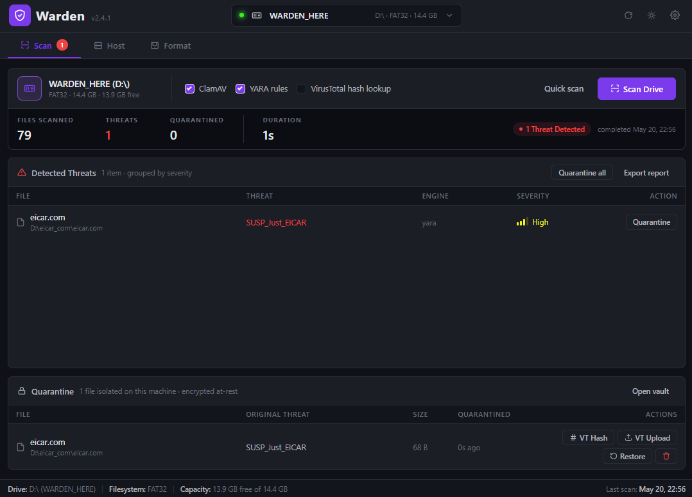
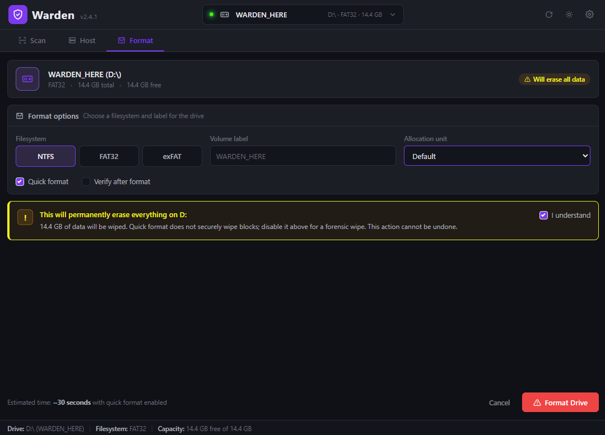
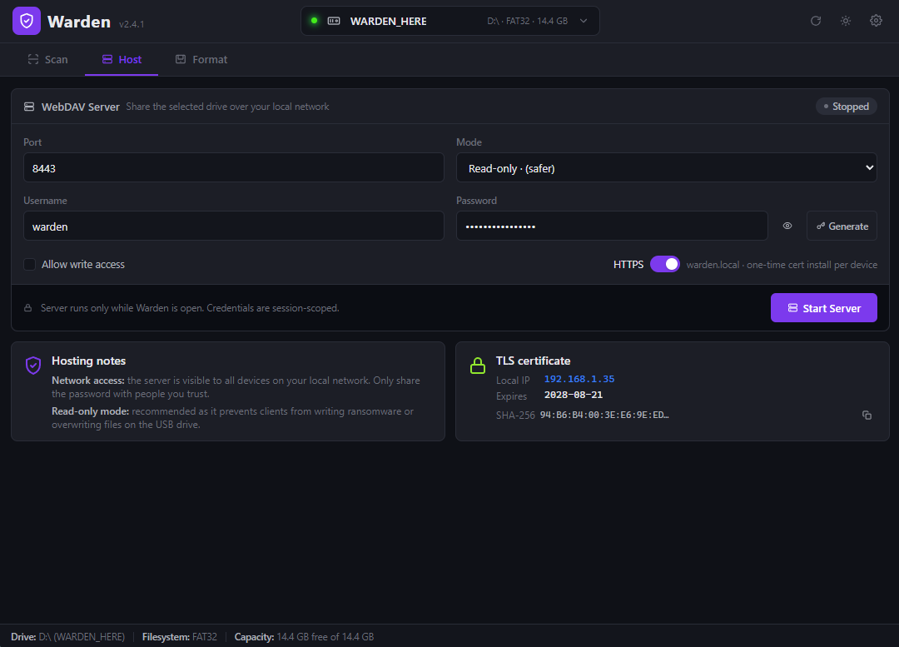
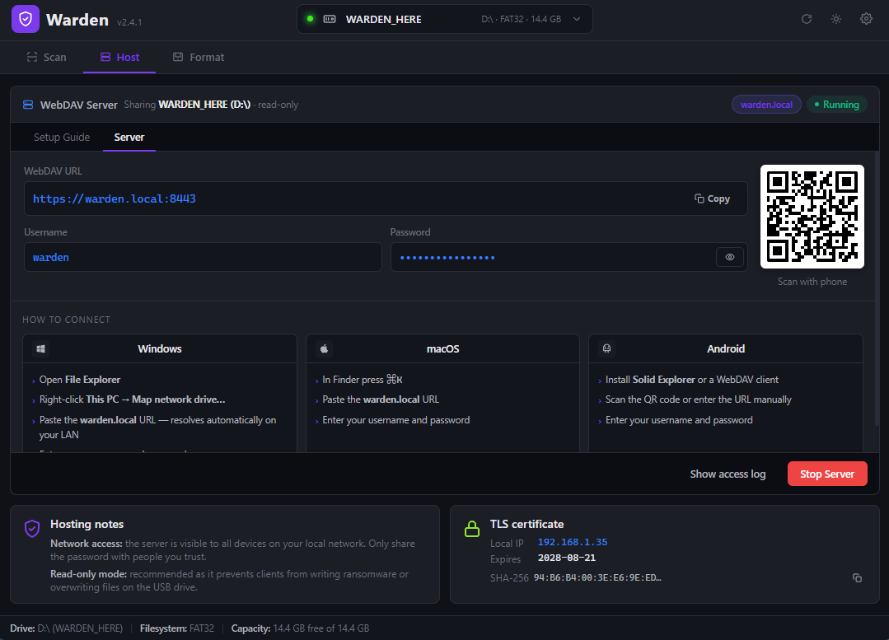
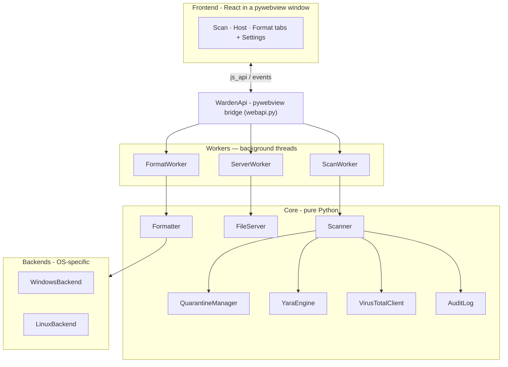

<div align="center">

# Warden

### USB Security & Sanitizer Tool

Scan removable drives for malware, quarantine threats, securely wipe drives,
and share their contents over an encrypted local connection — all from one
cross-platform desktop app.




</div>

---

## Overview

**Warden** is a desktop security tool for working with untrusted USB drives. Plug in a drive and Warden can scan every file with multiple malware engines, move anything dangerous into an isolated quarantine, securely reformat the drive, or turn it into an encrypted file share that other devices on your network can reach. It runs on **Windows and Linux** from a single codebase.

## Features

| Feature                     | Description                                                                                                                                   |
| --------------------------- | --------------------------------------------------------------------------------------------------------------------------------------------- |
| **Multi-engine scanning**   | Files are checked against **ClamAV**, **YARA** rules, and optionally **VirusTotal** hash lookups.                                             |
| **Automatic quarantine**    | Detected threats are moved off the USB drive into an isolated store, stripped of execute permissions, and tracked by SHA-256.                 |
| **VirusTotal integration**  | Look up file hashes or upload quarantined samples for full multi-engine analysis. API key stored securely in the OS credential vault.         |
| **Live YARA rules**         | One-click download of community signatures from [Neo23x0/signature-base](https://github.com/Neo23x0/signature-base).                          |
| **Secure drive formatting** | Reformat drives to NTFS, exFAT, FAT32, or ext4 with an explicit, type-to-confirm safeguard.                                                   |
| **Encrypted file hosting**  | Share a drive over **WebDAV-over-HTTPS** with an auto-generated local CA, `warden.local` mDNS discovery, a QR code, and a per-OS setup guide. |
| **Append-only audit log**   | Every scan, quarantine, format, and server action is recorded to a tamper-evident JSON Lines log.                                             |
| **Hot-plug aware**          | USB drives are detected as they're connected and removed.                                                                                     |
| **Dark & light themes**     | A clean, modern interface that adapts to your preference.                                                                                     |

## Screenshots

<div align="center">

|                              Scan                               |                              Format                               |
| :-------------------------------------------------------------: | :---------------------------------------------------------------: |
|                |              |
|                    **Host** - configuration                     |                        **Host** - running                         |
|  |  |

_A light theme is available via the toggle in the header._

</div>

## Architecture

Warden is built in clean layers. A React interface in a native window, talking to a Python core through an in-process bridge using pywebview's `js_api`.



## Requirements

- **Python 3.10+**
- Windows 10/11 or a modern Linux distribution
- **ClamAV** _(optional, recommended)_ for ClamAV-based detection,
  Install the ClamAV engine via your OS (`apt install clamav clamav-daemon`, or the Windows installer).
  Without it, Warden still scans with YARA and VirusTotal.

> Note: the `clamd` pip package is only the client library, it is **not** the engine.

## Installation

```bash
# 1. Clone the repository
git clone <repo-url>
cd usb-sanitizer-tool

# 2. Create a virtual environment
python -m venv .venv
# Windows:
.venv\Scripts\activate
# Linux:
source .venv/bin/activate

# 3. Install dependencies (pick your platform)
pip install -r requirements-windows.txt   # Windows
pip install -r requirements-linux.txt     # Linux

# 4. Fetch the frontend vendor files (React, Babel, QR code)
python setup_web.py

# 5. Launch
python main.py
```

> Run with `python main.py --debug` to open the developer console.

## Usage

> **First run — install YARA rules.** To keep this repository lean, Warden does
> **not** ship with the YARA signature database. On first launch, open
> **Settings** (gear icon, top-right) → **Update YARA Rules** to download the
> rules from [Neo23x0/signature-base](https://github.com/Neo23x0/signature-base).
> Until you do, a red dot appears on the gear icon and YARA-based detection is
> skipped during scans.

1. **Plug in a USB drive:** Warden detects it automatically and lists it in the header.
2. **Scan:** choose your engines and run a scan; threats are auto-quarantined.
3. **Review quarantine:** restore, delete, or send samples to VirusTotal.
4. **Format:** securely reformat a drive (requires typing the drive letter to confirm).
5. **Host:** share a drive over encrypted WebDAV; other devices scan a QR code for setup.

Open **Settings** (gear icon, top-right) to update YARA rules, set your VirusTotal API key, or view the audit log.

## Security

- **VirusTotal API key** is stored in the operating system's credential vault (Windows Credential Manager / macOS Keychain / Linux Secret Service) via the `keyring` library and never in plaintext. On systems with no secure backend (e.g. headless Linux), Warden falls back to config storage and **warns you**.
- **File hosting** uses HTTPS with a locally generated CA; a plain-HTTP helper serves only the CA certificate so clients can bootstrap trust.
- **Quarantined files** are moved off the drive and have their execute permissions removed.
- **Audit log** is append-only JSON Lines, stored under the app data directory.
- Uploading a file to VirusTotal shares it with a third party. Note: Warden treats this as an explicit, opt-in action.

## Project structure

```
main.py              App entry point — wires everything together
webapi.py            WardenApi — the JS <-> Python bridge
setup_web.py         Downloads frontend vendor files
config/              Settings & secure key storage
core/                Scanner, quarantine, file server, YARA, VirusTotal, audit
backends/            OS-specific drive backends (Windows / Linux)
workers/             Background threads for scan / format / server
web/                 React frontend (JSX, transformed at runtime by Babel)
rules/               Downloaded YARA signatures
```

## Disclaimer

Warden can **permanently erase data** when formatting drives. Always confirm you have the correct drive selected. The authors provide this software as-is, with no warranty. Malware scanning reduces risk but is never a guarantee, treat unknown USB drives with caution.

## License

Released under the [MIT License](LICENSE) — © 2026 Abhijeet.
